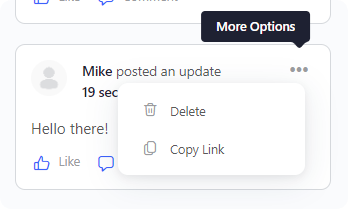

<!-- ABOUT THE PROJECT -->

## About The Project

With this plugin, you can add a "Copy link" button under activity post settings. It's simple as possible!

### Just

Download the plugin and add it to your buddyboss website.

Good Luck!
